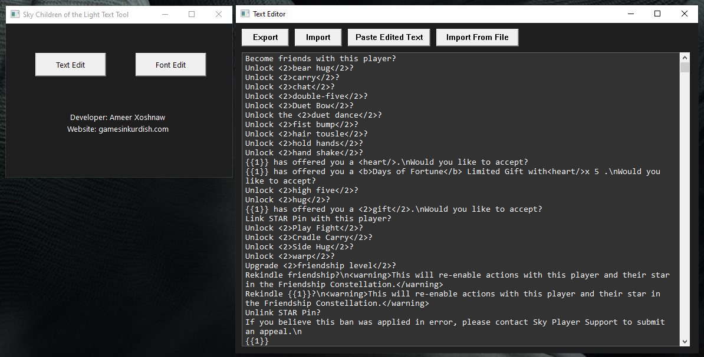

# Sky Children of the Light Text Localization Tool

A one-click translation mod tool for *Sky: Children of the Light*, built to help fans translate the game's text by automatically exporting and importing modded text files.

## Screenshot

## Tutorial Video

## Features

- **Text Edit**: Extract and modify in-game text files.
- **Font Edit**: Customize font files used in the game.
- **Simple Interface**: Lightweight and user-friendly GUI.
- **Safe Localization**: Only modifies text and font files, avoiding game data edits that could trigger anti-cheat systems.

## Developer

**Ameer Xoshnaw**  
Website: [gamesinkurdish.com](https://gamesinkurdish.com)

## Disclaimer

This tool is provided for educational and localization purposes only. It does not alter gameplay or online data, and is not intended to bypass game security systems. Use at your own risk.
